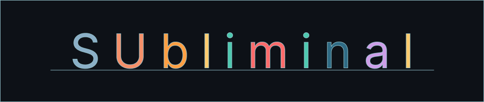

# Subliminal Neovim

A high-contrast dark theme for Neovim with deep GitHub-dark-inspired surfaces, warm orange accents, and full Treesitter + LSP semantic token support. Built for long coding sessions with an emphasis on readability, visual hierarchy, and aesthetic consistency across your entire terminal setup.

---

## Preview

[enums](./assests/structs.png)

[structs and methods](./assests/enums.png)

---

## Color Palette

| Role | Hex | Preview |
|---|---|---|
| Background | `#0d1117` |  |
| Surface | `#161b22` |  |
| Elevated | `#21262d` |  |
| Border | `#30363d` |  |
| Foreground | `#fef6fd` |  |
| Muted | `#8b949e` |  |
| Accent (Orange) | `#f5906a` |  |
| Teal | `#4ec9b0` |  |
| Blue | `#8bafc7` |  |
| String | `#ffd9b3` |  |
| Number | `#ff9f43` |  |
| Error | `#ff6b6b` |  |
| Warning | `#fdcb6e` |  |

---

## Syntax Highlighting

| Token | Color |
|---|---|
| Keywords | `#8bafc7` bold |
| Classes / Types | `#4ec9b0` bold |
| Functions | `#f5906a` bold |
| Strings | `#ffd9b3` |
| Numbers | `#ff9f43` bold |
| Constants | `#c5bc91` bold |
| Comments | `#7d8590` italic |
| Parameters | `#cdd6f4` italic |
| Operators | `#ddd9f6` bold |
| Booleans / Conditionals | `#b39dfb` bold |
| Fields / Properties | `#a8ffdd` |

### Extended Rust Support

Subliminal ships Treesitter and LSP semantic token overrides for Rust including lifetimes, enum variants, traits, crates, derive attributes, `self` parameters, and macro invocations — all tuned to match the feel of the colorscheme.

---

## Installation

### lazy.nvim

```lua
{
  "GhostVox/subliminal.nvim",
  lazy = false,
  priority = 1000,
  config = function()
    vim.cmd("colorscheme subliminal")
  end,
}
```

### packer.nvim

```lua
use {
  "GhostVox/subliminal.nvim",
  config = function()
    vim.cmd("colorscheme subliminal")
  end,
}
```

### vim-plug

```vim
Plug 'GhostVox/subliminal.nvim'
```

Then add to your `init.vim` or `init.lua`:

```vim
colorscheme subliminal
```

```lua
vim.cmd("colorscheme subliminal")
```

### Manual Installation

Clone the repository into your Neovim data directory:

```bash
git clone https://github.com/GhostVox/subliminal.nvim \
  ~/.local/share/nvim/site/pack/plugins/start/subliminal.nvim
```

Then set the colorscheme in your config:

```lua
vim.cmd("colorscheme subliminal")
```

---

## Requirements

- Neovim `0.9+`
- A terminal with true color support (`set termguicolors` / `vim.o.termguicolors = true`)
- [nvim-treesitter](https://github.com/nvim-treesitter/nvim-treesitter) for full syntax highlighting (recommended)

---

## Features

- Deep GitHub-dark-inspired surface palette (`#0d1117` base) consistent with terminal environments
- Orange (`#f5906a`) accent carried through the cursor, active line number, search highlights, tab selection, and completion menu
- Carefully layered backgrounds — base, surface, elevated, and hover states all distinct without being jarring
- Full Treesitter highlight group coverage across all standard capture names
- LSP semantic token overrides including Rust-specific tokens (`@lsp.type.macro.rust`, etc.)
- Extended Rust support with proper coloring for lifetimes, traits, macros, enum variants, and derive attributes
- Diagnostic highlights with both virtual text and underline variants
- Plugin support: Telescope, nvim-tree, gitsigns, Copilot, MiniIcons

---

## Origin

Subliminal started as a custom colorscheme built around the `dark_pro` palette — a Catppuccin Mocha-adjacent aesthetic with a heavier blue-gray structural tone and warm orange accents. The goal was a theme that feels at home in a Hyprland + terminal workflow without sacrificing readability during long coding sessions.

---

## License

MIT — do whatever you want with it.

---

## Author

**Ghostvox** — [github.com/ghostvox](https://github.com/ghostvox)
